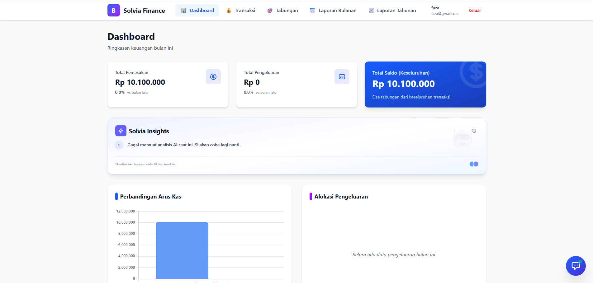
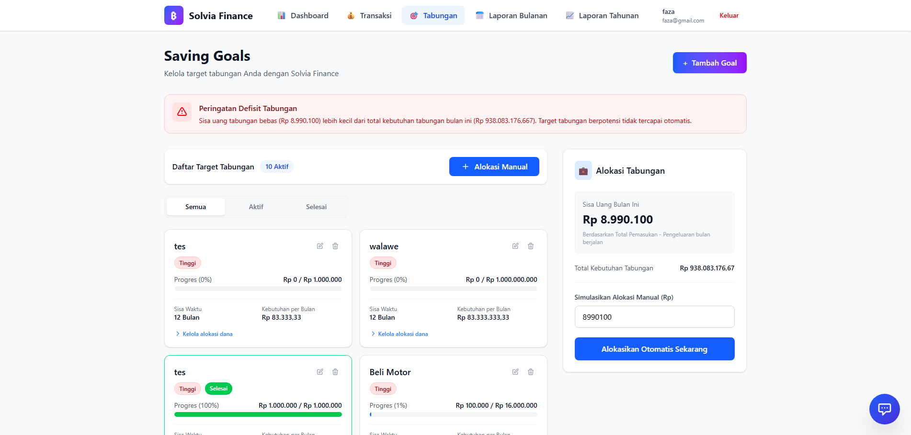

# 💰 Laporan Keuangan  
### AI-Powered Personal Finance Management Web App

Aplikasi web modern untuk **mengelola keuangan pribadi** dengan sistem **tracking, perencanaan tabungan (goals), dan analisis keuangan berbasis AI**.

> 🚀 Built for scalability, real-world usage, and intelligent financial insights.

---

## ✨ Features Overview

### 📊 Dashboard Real-Time
- Ringkasan keuangan (Saldo, Pemasukan, Pengeluaran)
- Highlight **Top 3 Saving Goals**
- Monitoring kondisi keuangan secara cepat & intuitif

---

### 💳 Transaction Management
- Pencatatan pemasukan & pengeluaran
- Kategori & riwayat transaksi
- Data terstruktur untuk analisis lanjutan

---

### 🎯 Multi Goals Saving System
- Membuat banyak target tabungan (multi goals)
- Perhitungan otomatis kebutuhan per bulan
- Progress tracking setiap goal
- **Alokasi dana (manual & otomatis)**
- **Validasi saldo & target (anti over-allocation)**
- **Edit & reallocation antar goals**

---

### 🤖 AI Financial Assistant
- Chat AI terintegrasi (bubble chat di dashboard)
- Analisis keuangan berdasarkan data user
- Insight & saran personal (real-time)
- Fokus hanya pada konteks keuangan (smart restriction)

---

### 📈 Smart Financial Reports
- Laporan bulanan & tahunan
- Grafik pemasukan vs pengeluaran
- Analisis kategori pengeluaran
- Insight otomatis berbasis AI

---

### 🔐 Authentication & Access Control
- Sistem autentikasi user
- Role-based access (ADMIN, USER, VIEWER)
- Keamanan data & manajemen akses

---

## 🖼️ Preview

> Tambahkan screenshot di sini biar makin menarik 👇

### Dashboard


### Goals / Tabungan


### AI Chat Assistant


---

## 🛠️ Tech Stack
- **Next.js (App Router)** + React + TypeScript  
- **Tailwind CSS**  
- **MySQL / PostgreSQL + Prisma ORM**  
- **NextAuth (Auth.js)**  
- **Chart.js**  
- **OpenAI API (AI Integration)**

---

## 🚀 Quick Start
```bash
git clone https://github.com/fazaram/Laporan-Keuangan
cd laporan-keuangan
npm install
npm run dev